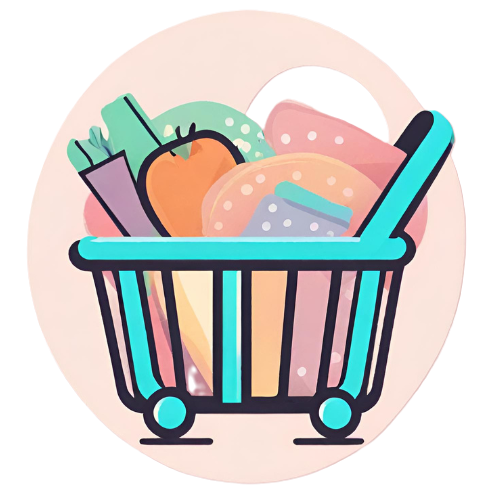
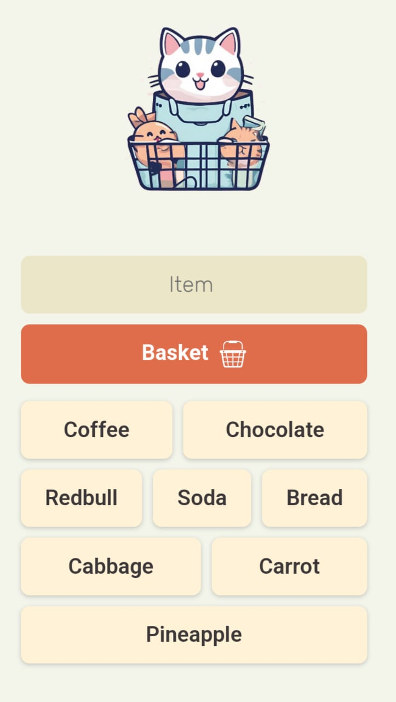

# Basket - Your Personal Shopping List Manager

Welcome to Basket, your go-to web app for effortlessly managing your shopping list! Say goodbye to forgotten items and tedious paper lists. With Basket, creating and managing your shopping list is a breeze.

## Features

### 1. **Intuitive User Interface**
Basket boasts a clean and user-friendly interface, making it easy for anyone to use. No more confusion – just a seamless shopping list creation experience.

### 2. **Effortless Input**
Adding items to your shopping list has never been simpler. Just type in the items you need, and Basket will take care of the rest. No more fumbling with complicated forms – it's all about efficiency.

### 3. **Interactive List**
Each item in your shopping list is interactive. Tap on an item to remove it. Keep your list organized and updated with just a few taps.

### 4. **Sync Across Devices**
Access your shopping list anytime, anywhere. Basket syncs seamlessly across devices, ensuring you have your list at your fingertips whether you're at home, in the store, or on the go.

## Screenshots

## Getting Started

### Installation

To get started with Basket, simply visit [basket]([https://www.basket-app.com](https://playful-rabanadas-70db97.netlify.app/)) . You can also add the web app to your home screen for quick access.

### Usage

1. **Adding Items:**
   - Type the item name in the input field.
   - Press or click the "Basket" button.

2. **Managing List:**
   - Tap to remove items from the list.

3. **Syncing Across Devices:**
   - Access your Shopping list across the devices.

### Happy shopping with Basket! 🛒🎉
